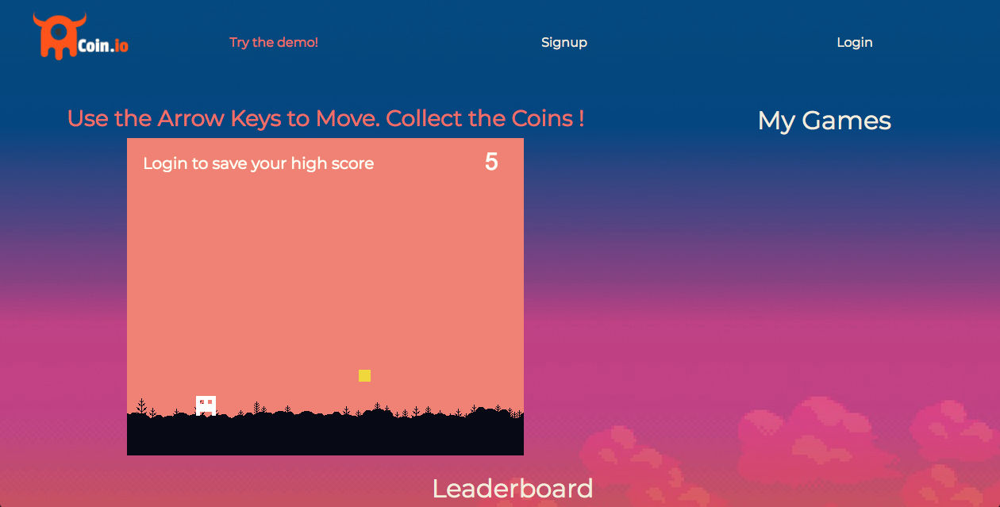
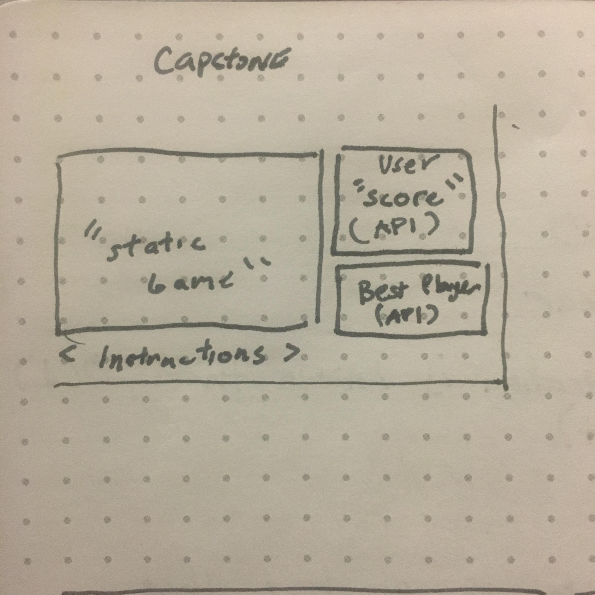

# [Coin.io](https://github.com/KingNaranja/Coin-Minigame/) 

# Compete for the Highscore!

# [Coin.io Api Server](https://github.com/KingNaranja/Minigame-Api)

Coin.io repositories:
https://github.com/KingNaranja/Coin-Minigame 
https://github.com/KingNaranja/Minigame-Api

Links to deployed sites: 
Minigame Client: https://kingnaranja.github.io/Coin-Minigame/
Minigame API: https://aqueous-oasis-20309.herokuapp.com/

# What is it ?
A single page web application that allows users to sign-up, play a simple arcade game and try to compete against the high scores of other users.

## How it works
When a user logs in, the app fetches the leaderboard from the database as well as initializes a *Phaser* game scene. The only goal is to colect the gold coin by controlling the player with the arrow keys before running out of time. When the game time is over, the users score and highscore are sent with a PATCH request to the API. 

The game leaderboard is processed by handlebars before being appended to the DOM. The user can then remove games they have already played from the database.

Phaser is an open-source HTML5 game framework that is used to create game that will run 
on desktop and mobile. This web app makes a single Phaser scene that users can play once they are logged in.

# Technologies Used:
### Client
 * HTML / CSS
 * JavaScript
 * jQuery
 * Ajax
 * Handlebars.js
 * SASS
 * Bootstrap
 * *Phaser 3*

### API
* JavaScript
* Express
* MongoDB
* Mongoose
* Node.js

# WireFrames and Documentation

* [User Stories](https://imgur.com/dAujhg4)

## Planning
During my initial days of planning, I spent time outlining the MVP objectives and 
creating documentation:
 * User Stories
 * Wireframes
 * ERD
 * Reach Goals

Moreover, while you can find several of Phaser guides on the internet, I found myself consistently returning to Catt Small's [Introduction to Phaser Tutorial](https://www.youtube.com/watch?v=T9kOFSFvgKc).

 ## Problem Solving
In order to reach my initial scope for this project I relied heavily on official documentation to research similar issues and their solutions.

Using *Phaser 3* led to issues finding up-to-date support as the framework recently upgraded from *Phaser 2*, however the community over at [html5GameDevs](http://www.html5gamedevs.com/) was extremely helpful in me parsing through the documentation.

## Future
In development:
- additional coins to collect
- additional game levels 
- enemy projectiles 
- in game buttons 

In the future I also plan to implement additional game scenes using Phaser's built-in scene manager. The leaderboard will then track the user's high score throughout all game levels.
